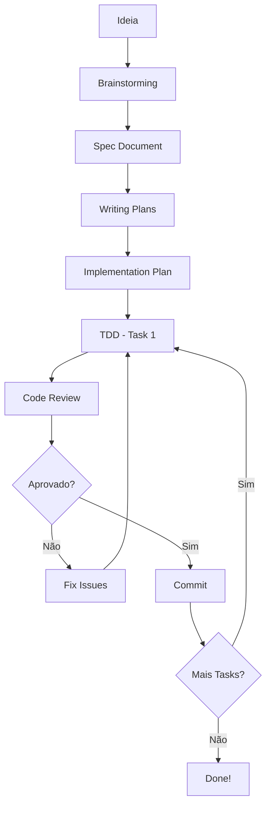

# AnswerHunter - Agent Skills System 

## 🎉 Sistema Instalado com Sucesso!

Você agora tem um **framework de skills inspirado no Superpowers** adaptado para GitHub Copilot.

## 📚 O que foi criado?

### Skills Principais
✅ **brainstorming** - Design e refinamento de features  
✅ **writing-plans** - Planos detalhados de implementação  
✅ **test-driven-development** - TDD rigoroso (RED-GREEN-REFACTOR)  
✅ **systematic-debugging** - Debug em 4 fases  
✅ **requesting-code-review** - Checklist de code review  

### Templates
✅ **FEATURE_SPEC.md** - Template para especificações  
✅ **IMPLEMENTATION_PLAN.md** - Template para planos  

### Documentação
✅ **README.md** - Overview do sistema  
✅ **QUICK_START.md** - Guia rápido de uso  

## 🚀 Como Começar?

### 1. Leia o Quick Start
```
Abra: .agents/QUICK_START.md
```
Tem exemplos práticos de como usar cada skill com o Copilot.

### 2. Explore uma Skill
```
Abra: .agents/skills/test-driven-development/SKILL.md
```
Cada skill tem exemplos específicos para o AnswerHunter.

### 3. Use os Templates
```
Para nova feature:
- Use: .agents/templates/FEATURE_SPEC.md
- Crie em: .agents/specs/sua-feature.md

Para implementação:
- Use: .agents/templates/IMPLEMENTATION_PLAN.md
- Crie em: .agents/plans/sua-feature-plan.md
```

## 💬 Exemplos de Comandos

### Design
```
"Vamos fazer brainstorming sobre adicionar suporte a PDFs"
"Use a skill de brainstorming para refinar esta feature"
```

### Planejamento
```
"Crie um plano detalhado para implementar cache de buscas"
"Use o template de implementation plan para esta spec"
```

### Desenvolvimento
```
"Use TDD para implementar o SearchService"
"Aplique o ciclo RED-GREEN-REFACTOR para esta feature"
```

### Debug
```
"Use systematic-debugging para resolver este crash"
"Debug: extensão falha quando documento do Word está vazio"
```

### Review
```
"Faça code review das minhas mudanças"
"Aplique o checklist de code review antes de commitar"
```

## 🎯 Princípios Fundamentais

### 1. TDD é Obrigatório
```
❌ NUNCA: Código → Teste
✅ SEMPRE: Teste → Código
```

### 2. YAGNI - You Aren't Gonna Need It
```
Se não está na spec, não implemente.
Zero features especulativas.
```

### 3. DRY - Don't Repeat Yourself
```
Viu código duplicado? Abstraia.
Três repetições = hora de refatorar.
```

### 4. Evidence Over Claims
```
Não: "Está funcionando" (sem verificar)
Sim: "Teste passa, comportamento confirmado"
```

## 📂 Estrutura Criada

```
.agents/
├── README.md                    # Overview geral
├── QUICK_START.md              # Guia rápido ⭐
├── INSTALLATION_SUCCESS.md     # Este arquivo
│
├── skills/                      # Skills disponíveis
│   ├── brainstorming/
│   │   └── SKILL.md
│   ├── writing-plans/
│   │   └── SKILL.md
│   ├── test-driven-development/
│   │   └── SKILL.md
│   ├── systematic-debugging/
│   │   └── SKILL.md
│   └── requesting-code-review/
│       └── SKILL.md
│
├── templates/                   # Templates para copiar
│   ├── FEATURE_SPEC.md
│   └── IMPLEMENTATION_PLAN.md
│
├── specs/                       # Crie suas specs aqui
├── plans/                       # Crie seus planos aqui
└── reviews/                     # Code reviews vão aqui
```

## 🎓 Workflow Recomendado



## 💡 Dicas de Uso com Copilot

### ✅ Faça
- Mencione a skill: "Use a skill de TDD"
- Dê contexto: "No projeto AnswerHunter..."
- Abra o arquivo da skill para dar contexto
- Seja específico sobre o que quer

### ❌ Evite
- Comandos vagos: "Faça algo"
- Pular TDD: Não tem exceções!
- Tarefas gigantes: Quebre em 2-5 min cada
- Ignorar os princípios: YAGNI, DRY, etc.

## 🔍 Exemplo Prático

### Você quer: Adicionar cache de buscas

**Passo 1 - Brainstorming**:
```
Você: "Vamos fazer brainstorming sobre adicionar cache de buscas no AnswerHunter"

Copilot: [faz perguntas, explora alternativas, cria spec]
→ Cria: .agents/specs/search-cache.md
```

**Passo 2 - Planning**:
```
Você: "Crie um plano detalhado baseado na spec de search-cache"

Copilot: [quebra em tarefas pequenas com TDD]
→ Cria: .agents/plans/search-cache-plan.md
```

**Passo 3 - Implement (TDD)**:
```
Você: "Vamos implementar a Task 1 usando TDD"

Copilot: 
🔴 RED: Escreve teste que falha
🟢 GREEN: Implementa código mínimo
🔵 REFACTOR: Limpa o código
✅ Commit

Repeat para cada task...
```

**Passo 4 - Review**:
```
Você: "Code review antes do commit final"

Copilot: [aplica checklist, identifica issues]
→ Cria: .agents/reviews/20260212-search-cache.md
```

**Passo 5 - Finish**:
```
Você: Corrige issues encontrados
✅ Merge para main
🎉 Feature completa!
```

## 🎨 Customize para Você

As skills são flexíveis! Você pode:
- Ajustar os templates
- Adicionar novas skills
- Modificar os workflows
- Adaptar ao seu estilo

A estrutura está no `.agents/`, apenas edite os arquivos `.md`.

## 🆘 Precisa de Ajuda?

1. **Leia o Quick Start**: `.agents/QUICK_START.md`
2. **Explore as Skills**: Cada uma tem exemplos práticos
3. **Use os Templates**: Copie e adapte
4. **Pratique**: Comece com uma feature pequena

## 📖 Leituras Recomendadas

**Para começar**:
1. `.agents/QUICK_START.md` ⭐ COMECE AQUI
2. `.agents/skills/test-driven-development/SKILL.md`
3. `.agents/skills/brainstorming/SKILL.md`

**Para se aprofundar**:
4. `.agents/skills/writing-plans/SKILL.md`
5. `.agents/skills/systematic-debugging/SKILL.md`
6. `.agents/skills/requesting-code-review/SKILL.md`

## 🎯 Próximo Passo

**Abra agora**: `.agents/QUICK_START.md`

Depois tente com uma feature real do AnswerHunter!

---

## 💪 Você está pronto!

Este sistema vai transformar como você desenvolve com o GitHub Copilot.

**Lembre-se**:
- TDD é obrigatório (não negociável)
- Design antes de código
- Tarefas pequenas (2-5 min)
- Evidence over claims

Happy coding! 🚀

---

**Dúvida?** Pergunte ao Copilot:
```
"Como uso as skills do .agents?"
"Explica o workflow TDD das skills"
"Me guie pelo processo de brainstorming"
```
